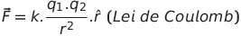
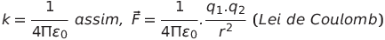
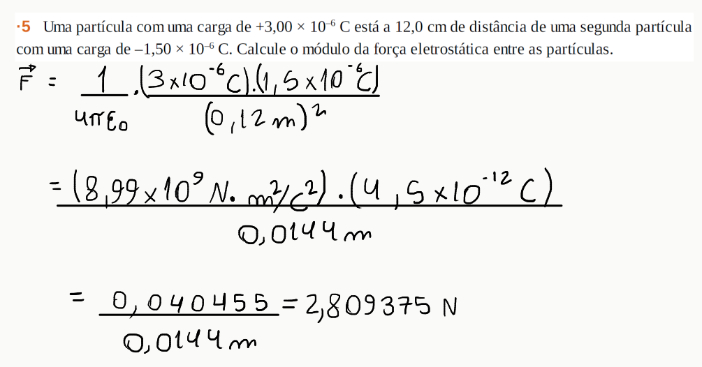
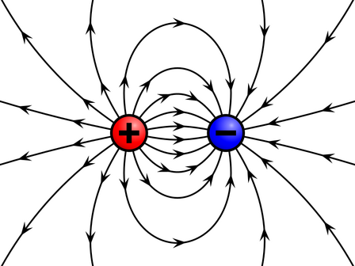
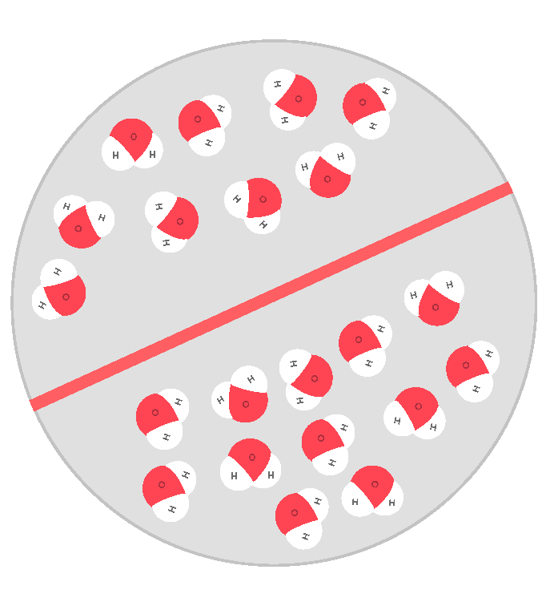
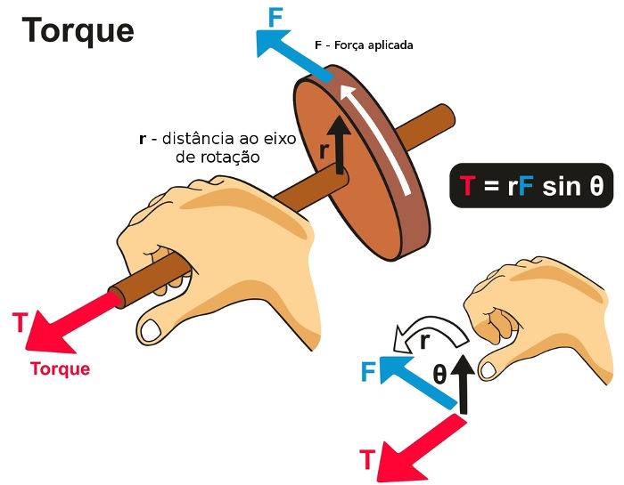

# Portfólio 1

### Lei de Coulomb
Se tivermos partículas carregadas elas exercem forças entre si, ou seja, se temos duas partículas carregadas elas podem causa uma atração ou repulsão uma pela outra. Essa atração ou repulsão é causada pela carga da partícula, se a carga possue sinais opostos existe atração, como se existe repulção com sinais iguais.

A lei de Coulomb é a equação para cálculo dessa força exercida por uma partícula carregada uma pela outra, que é chamada de força eletroestática. Onde para duas partículas de cargas q1 e q2 respectivamente, temos que a força eletroestática em q1 se dá por:

ȓ = vetor unitário que demonstra direção e sentido.

r = distancia entre as duas particulas.

k = constante de Coulomb.

Se as duas particulas tiverem sinais iguais ocorrerá repulsão, assim a força exercida em q1 terá o mesmo sentido que ȓ, então o produto q1q2 será positivo, mas se as cargas forem opostas e houver atração a força exercida em q1 terá o sentido inverso a ȓ, tendo o resultado do produto de q1q2 negativo.

[youtube](https://www.youtube.com/watch?v=hpNTUkqW66U)

Assim com o tempo foi decidido que teriamos a constante de Coulomb como k = 1/4πε₀, temos a constate de permissividade ε₀ = 8,85x10ˉ¹²C²/N·m² e teremos o modulo da força eletroestática pela lei de Coulomb como:

Exemplo:

### Carga Quantizada
A carga elétrica é composta de unidades elementares, que podem ter a forma escrita como o produto q = n·e, onde:

n = um número inteiro.

e = é o menor valor carga elétrica na natureza, o valor da carga encontrado em protons e eletrons, que tem como modulo = 1,6x10ˉ¹⁹C.

### Campo Elétrico
d

### Dipolo Elétrico
É representado por um par de cargas opostas, a uma distancia (d) e de mesmo modulo (q).

retirado do link: [olimpedia](https://olimpedia.fandom.com/pt-br/wiki/Eletricidade) [^1]

Existe também o momento dipolar de moléculas, o que são os causadores do comportamento dessa molécula a um campo elétrico externo.

### Curiosidade: O que acontece com a molécula de água no microondas?
A água é uma molécula polar, possui momento dipolar elétrico, o que quer dizer que quando colocada em um campo magnético tende a alinhar-se ao campo

retirado do link: [TecnoBlog](https://tecnoblog.net/meiobit/421847/como-funciona-um-forno-de-micro-ondas/) [^1]

E quando esse campo tende a variar, como no microondas, ela varia com o campo e junto a esse movimentos as moléculas de água acabam também se raspando com as moléculas vizinhas transferindo energia e aumentando a agitação mais ainda, o que como resultado temos o que chamamos no dia a dia de ficar “quente”.

Esse fenômeno é chamado de **aquecimento dielétrico**.

retirado do link: [Doce Limão](https://www.docelimao.com.br/site/tv-de-bem/2660-tv-de-bem-16-video-2-processos-que-desvitalizam-e-intoxicam-alimentos-microondas.html) [^1]

<iframe
    width="640"
    height="480"
    src="https://www.youtube.com/watch?v=kRoYdzPRiV8"
    frameborder="0"
    allow="autoplay; encrypted-media"
    allowfullscreen
>
</iframe>

### O que é torque ?
É uma grandeza vetorial, o qual, é a propensão de que uma força aplicada a um corpo tem de o rotacionar. Como na imagem a baixo, o vetor torque é o produto vetorial da distância ao eixo de rotação (r) e a força aplicada (F), vezes um sen θ, o angulo entre r e F.

τ = r.F.sen θ

Se θ = 90°, sen = 1,

Então,

τ = r.F

retirado do site : [Brasil Escola](https://brasilescola.uol.com.br/fisica/torque-uma-forca.htm) [^1]

A direção e sentido do vetor torque pode ser definido pela regra da mão direita, onde a direção é a mesma do dedão se estivermos girando o pulso para frente.

### O que é braço de alavanca ?
A distância ao eixo de rotação citada no torque, pode também ser chamado de, comprimento do braço de alavanca.

[^1]: As fotos foram retiradas do google imagens, então não sei se é a fonte delas mesmo, só foi adicionado o link que o google mostra junto a elas.
